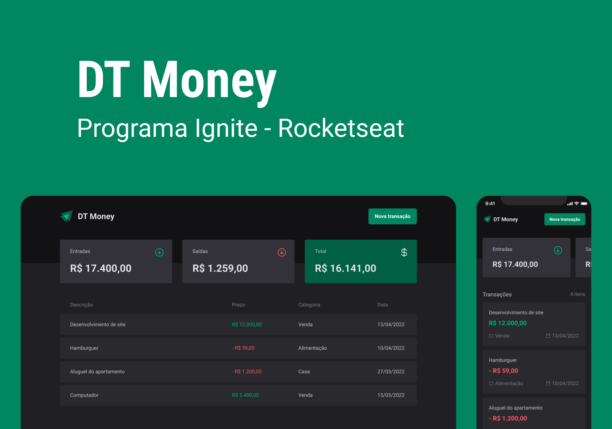

<h1 align="center">DTMoney | organização financeira</h1>

  

## 🚀 Tecnologias

Esse projeto foi desenvolvido com as seguintes tecnologias:

- React
- Typescript
- Node

## 💻 Projeto

O DTmoney é uma aplicação criada com o intuito de ajudar na organização das finanças dos usuários! Te permitindo traçar metas à partir do seu aporte financeiro e fazendo o necessário para cumprir os objetivos!

## 🔖 Layout

Você pode visualizar o layout do projeto através [desse link](https://www.figma.com/community/file/1138814493269096792/dt-money). É necessário ter conta no [Figma](https://figma.com) para acessá-lo.